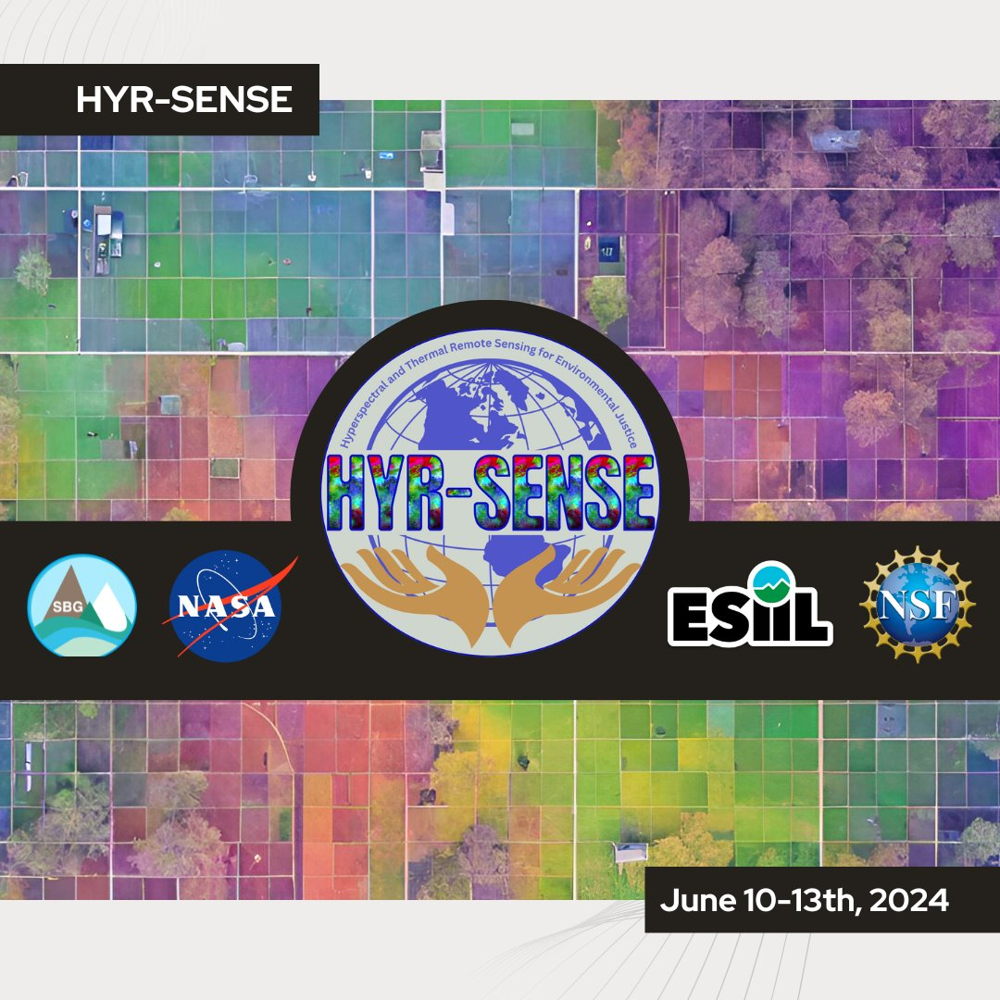

# HYR-SENSE: Hyperspectral and Thermal Remote Sensing for Environmental Justice

My name is Summer Dupree, and I'm a Mnicoujou/Mnikȟóžu Lakota woman from Wakpá Wašté Oyáŋke, the Cheyenne River Reservation of South Dakota. I'm also an undergrad student and research assistant at Oglala Lakota College. I'm in my third year studying natural science with an emphasis in conservation biology.
